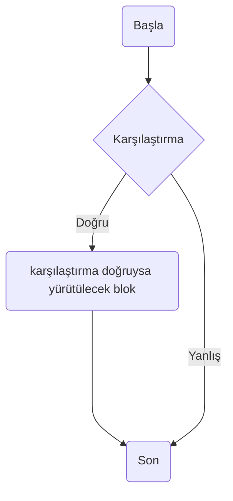

# Python Notlarım
S.A Arkadaşlar ilk anlatacağım bölümde python dilinin özelliklerini anlatmaya çalışacağım.Ama şunu belirteyim ne kadar anlatırsam anlatayım bazı ifadeler hiç bilmeyen birine yabancı gelecektir.Çeşitli örnekler vererek zengin bir anlatım hedefliyorum.Eğer daha önceden bir programlama dili bilmiyorsanız vereceğimiz örnekleri anlamaya çalışmayın.Herhangi bir dil biliyorsanız bir önceki bilgileriniz ile çelişecek vereceğimiz örnekler.Hatta size saçma gelecek.Her ne olursa olsun diğer bilgileriniz görmezden gelmeye çalışın mümkün olduğunca.Python beyninizde fırtınalar oluşturacak.Çünkü bu dil tamamen insan beyni nasıl düşünüyorsa öyle yazılmıştır.Bu dilde İnsanın düşünme tarzı temel alınmıştır.Şunu da unutmayın python ın tamamını öğrenmek imkansız ve gereksizdir.Pythonın sihirli dünyasında nasıl olmasını düşünüyorsanız öyle olacaktınişte bu seviyeye gelince kendinize olan özgüveniniz artacaktır arkadaşlar. Diğer dilleri öğrenme isteğiniz artacaktır.Buyrun hep birlikte şimdi python dilinin sihirli dünyasına gidelim. Python programlama dilinin özellikleri Python dilini diğer dillerden ayıran bir çok özellik vardır arkadaşlar.Bu dil ne kadar eski olsa bile insanlar tarafından az bilinmektedir.Biz burada bilinmeyenlere ışık tutacağız. Bu mükemmel dilin bazı özellikleri şöyledir: 

Python programlarını iki şekilde yazabilirsiniz. Birincisi etkileşimli olarak diğeri bir dosyaya yazarak bu dosyanın Python tarafından yorumlanmasını sağlayabilirsiniz. Etkileşimli kullanmak çoğu zaman bir anlam ifade etmez. Ancak kısa programlar yazacaksanız unuttuğunuz bir fonksiyonu denemek istiyorsanız. hemen Python kabuğunda istediğinizi yapabilirsiniz. Windows kullananlar için üç kabuk vardır.

1. Interpreter Shell
Bunu kullanmanızı tavsiye etmem kullanımı zordur. Siyah bir kabuğa saatlerce 

Sayı değişkenleri üzerinde tüm aritmetik işlemleri yapabilirsiniz, sonucuda daha sonra kullanmak üzere sayı değişkenlere atayabilirsiniz. Atama işlemi `=` ile yapılır.

```python
>>> a=5
>>> b=7
>>> c=a+b
```
Yazdığımız değişkenleri Python ekrana yazdırmadı. Çünkü sonucu bir değişkene atadık. Herhangi bir atama işlemi yapılmıyorsa etkileşimli ekranda sonuç standart çıktıya yazdırılır. İmleçte iken `c` yazıp enter tuşuna basarsanız işlem sonucunu görürsünüz.
```python
>>> c
12
```
Şimdi hemen şu işlemi yapalım.
```python
>>> c+d
Traceback (most recent call last):
  File "<stdin>", line 1, in <module>
NameError: name 'd' is not defined
>>>
```
Programın çıktısının 12 olmasını bekliyorduk değil mi? Python'a yeni başlayanlar bu hataya düşebilirler. Python'da bir değişken bir işlem içerisinde kullanılmadan önce mutlaka tanımlanmalıdır. Ön tanımlı değerler sıfır yada boş olamaz. 

### Üs Alma Operatörü **
```python
>>> 2 ** 3
8
```
### Modülüs/Kalan Operatörü %
```python
>>> 22 % 8
6
```

### Tam Değer Bölüm Operatörü //
```python
>>> 22 // 6
3
```

### Bölme Operatörü /
```python
>>> 22 / 6
3.6666666666666665
```

### Çarpma Operatörü *
```python
>>> 6 * 5
30
```

### Çıkarma Operatörü -
```python
>>> 30-5
25
```

### Toplama Operatörü +
```python
>>> 65+28
93
```

## Veri Tipleri
* Tam Sayılar: -2, -1, 0, 1, 2 gibi
* Kayan Noktalı Sayılar: 3.14, -1.0 0.5 gibi
* Dizgiler: 'a', 'kelime', 'Merhaba'

```python
tam_sayi = 10
pi_sayisi = 3.14
kelime = 'Pi'

print (tam_sayi)
print (pi_sayisi)
print (kelime)
```

Bir kelimeyi ve integer bir değeri birleştirmek istersek aşağıdaki hatayı alacağız. Sebebi ise str sadece str değişken tipi ile birleştirilebilir.

```
17:15 ~ $ python
Python 3.9.5 (default, May 27 2021, 19:45:35)                                                                                        
[GCC 9.3.0] on linux                                                                                                                 
Type "help", "copyright", "credits" or "license" for more information.                                                               
>>> 'Alice' + 42
Traceback (most recent call last):                                                                                                   
  File "<stdin>", line 1, in <module>                                                                                                
TypeError: can only concatenate str (not "int") to str                                                                               
>>>  
```

Alice kelimesini 5 defa yazdırmak için
```python
>>> 'Alice' * 5
'AliceAliceAliceAliceAlice'
```

## print ()
Ekrana kelime yazdırmak için kullanılır.
```python
print ("Merhaba")
```

## input ()
Klavye'den veri almak için kullanılır.
```python
print ("İsminiz nedir?")
isim = input()
print ("Merhaba " + isim)
```

## len ()
Bir dizgideki karakter sayının tam sayı değeri olarak değrlendirir. 
* Boşlukları da karakter olarak saymaktadır.
```python
>>> len ('yaz dostum say dostum')
21
```

## If Deyimi


Eğer anlamına gelen if sonuç doğru olduğunda sonra gelen bloğun çalıştırılmasını sağlar.

```
if karşılaştırma:
    karşılaştırma doğruysa
    yürütülecek blok
```


```python
if 5>4:
    print("5 rakamı 4 rakamından büyüktür.")
```
