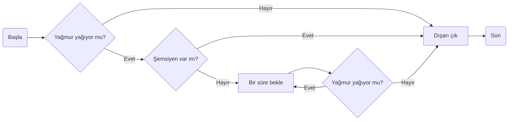

```mermaid
flowchart LR
    A(Başla) --> B{Yağmur yağıyor mu?}
    B -- Hayır --> D[Dışarı çık]
    B -- Evet --> C{Şemsiyen var mı?}
    C -- Hayır --> E[Bir süre bekle]
    E --> F{Yağmur yağıyor mu?}
    F -- Evet --> E
    C -- Evet --> D
    F -- Hayır --> D
    D --> G(Son)
```
